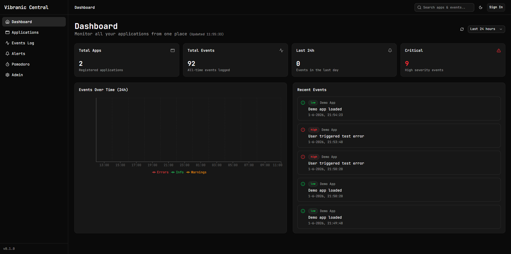

# Vibranic Central

> One dashboard to monitor every app you build — real-time events, alerts and status, all in one place.

**Live:** https://vibranic-central.com



---

## About

Vibranic Central is a personal **diagnostics & monitoring hub**. Apps connect through the **Vibranic SDK** and stream their events, errors and metrics to one always-on dashboard — so instead of checking every project separately, you see the health of your whole suite at a glance.

It's the backbone of the Vibranic app suite: every app I build reports into Central.

---

## Features

- **Unified event timeline** — see events, errors and warnings over time from every linked app, streamed in via the Vibranic SDK.
- **Per-app alerts** — set alerts on specific apps and get notified the moment one fails.
- **API key management** — generate API keys to connect new apps to Central in seconds.
- **Built-in Pomodoro** — manage your focus and breaks without leaving the dashboard.
- **Polished UX** — light/dark theme, global search across apps & events, responsive layout.

---

## Tech stack

| Layer | Tech |
|---|---|
| Framework | Next.js 16 (App Router) + React 19 + TypeScript |
| Styling | Tailwind CSS v4 + shadcn/ui (Radix UI) + lucide-react |
| Charts | Recharts |
| Database | PostgreSQL (Neon) |
| ORM | Prisma 6 |
| Auth | OpenID Connect (Passport + sessions) |
| Hosting | Deployed at vibranic-central.com |

---

## How it works

1. **Register an app** in Central and generate an API key.
2. **Add the Vibranic SDK** to that app and drop in the key.
3. The app **streams events** (info / warnings / errors) to Central.
4. **Watch them live** on the dashboard and set alerts on the apps that matter.

---

## Getting started

```bash
# 1. Clone
git clone https://github.com/kilianfrederix/vibranic-central.git
cd vibranic-central

# 2. Install
npm install

# 3. Environment — create .env.local with:
#   DATABASE_URL=...      (Neon PostgreSQL connection string)
#   SESSION_SECRET=...    (random secret for session signing)
#   ISSUER_URL=...        (OpenID issuer URL)
#   REPL_ID=...           (auth client id)
#   ADMIN_API_KEY=...     (admin access key)

# 4. Database
npm run db:generate   # prisma generate
npm run db:push       # sync schema to the database
npm run db:seed       # optional: seed demo data

# 5. Run
npm run dev
```

App runs at `http://localhost:3000`.

---

## Roadmap

- [ ] Migrate authentication to Clerk and deploy on Vercel
- [ ] Deeper **vibranic-orbit** integration (the productivity app in the suite)
- [ ] More alert channels (email / webhook)

---

## Author

**Kilian Frederix** — full-stack web developer, design-driven.
[vibranic-central.com](https://vibranic-central.com) · [LinkedIn](https://www.linkedin.com/in/kilian-frederix/)
